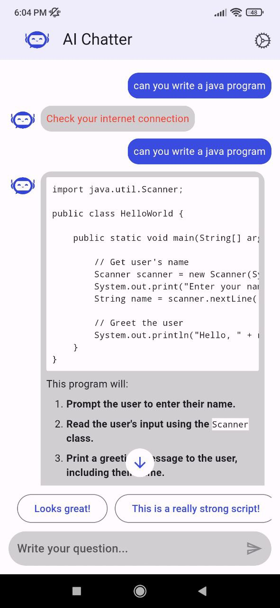
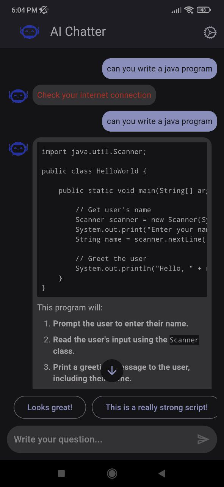
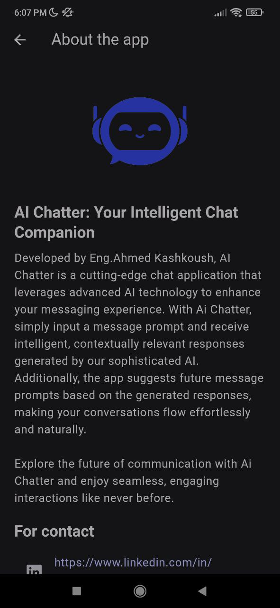

# AI Chatter

AI Chatter is a sophisticated chat application leveraging Google's Gemini large language model to enhance your messaging experience. With AI Chatter, you can input a message prompt, receive an intelligent response, and get suggestions for future prompts to keep the conversation flowing seamlessly.

## Features

- **Light/Dark Theme Switching**: Easily switch between light and dark themes.
- **Localization**: Supports English and Arabic languages.
- **Future Suggestions**: Option to turn on/off future message suggestions.
- **Feedback and Issue Reporting**: Report issues and send feedback via email.
- **Internet Connection Check**: Checks for an internet connection when the user sends a new message.
- **Message Actions**: 
  - For AI Responses: Copy, Select, Share, Delete, Regenerate (in case of error).
  - For User Messages: Copy and Select only.
- **Clear Chat History**: Clear all messages in the chat history.

## Screenshots

### Splash Screen
Light Theme | Dark Theme
:-------------------------:|:-------------------------:
 | 

### Intro Screen
Light Theme | Dark Theme
:-------------------------:|:-------------------------:
 | 

### Chat Screen
Light Theme | Dark Theme
:-------------------------:|:-------------------------:
 | 

### Settings Screen
Light Theme | Dark Theme
:-------------------------:|:-------------------------:
 | 

### About App Screen
Light Theme | Dark Theme
:-------------------------:|:-------------------------:
 | 

## Dependencies

The following dependencies are used in AI Chatter:

- `connectivity_plus`
- `cupertino_icons`
- `dartz`
- `easy_localization`
- `feedback`
- `flutter_bloc`
- `flutter_dotenv`
- `flutter_email_sender`
- `get_it`
- `google_generative_ai`
- `ionicons`
- `lottie`
- `path_provider`
- `scrollable_positioned_list`
- `share_plus`
- `shared_preferences`
- `url_launcher`
- `flutter_launcher_icons`
- `flutter_native_splash`

## Contact

For any issues, suggestions, or feedback, feel free to reach out via email.